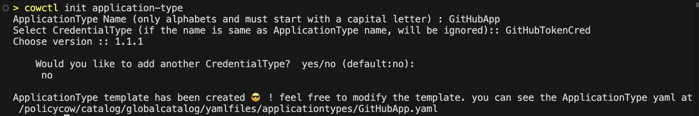
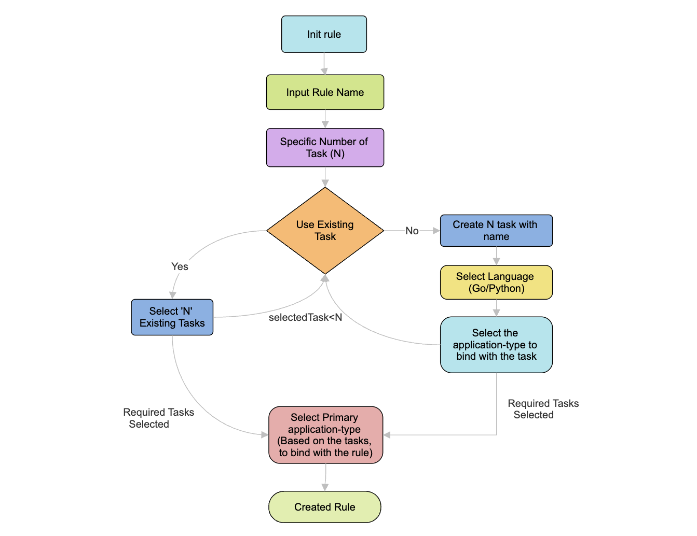
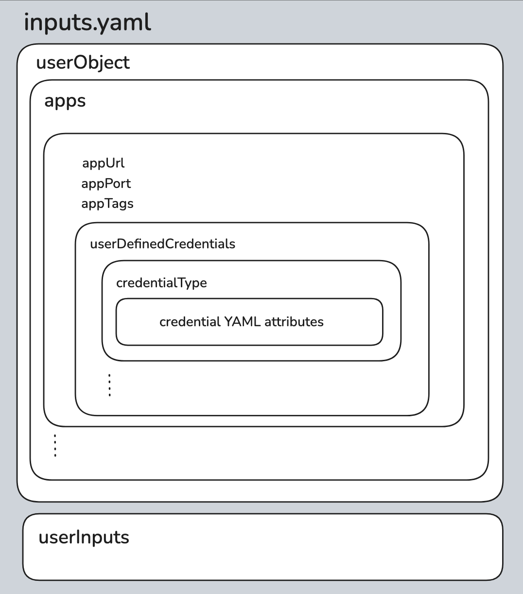
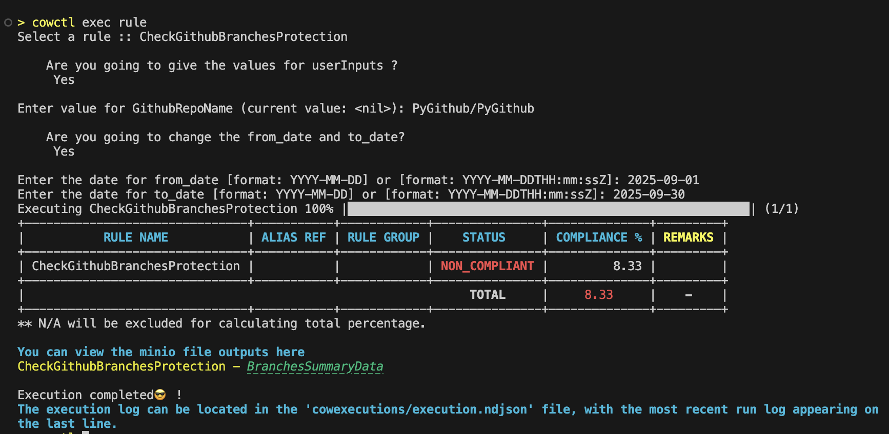
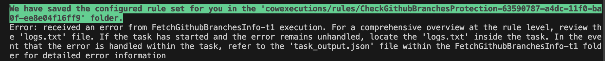

# Open Security Compliance

**ReadMe (Version 3.1)**

### Table of Contents

1. [Introduction](#introduction)
   1. [Glossary](#glossary)
   2. [Things to note](#things-to-note)
2. [Setting up cowctl CLI](#setting-up-cowctl-cli)
   1. [Prerequisites](#prerequisites)
   2. [Instructions](#instructions)
3. [Getting Started](#getting-started)
   1. [Developing a Rule](#1-developing-a-rule)
      1. [Creating a credential-type](#11-creating-a-credential-type)
      2. [Creating an application-type](#12-creating-an-application-type)
      3. [Initializing a task](#13-initializing-a-task)
      4. [Initializing a rule](#14-initializing-a-rule)
      5. [Implementing the business logic](#15-implementing-the-business-logic)
   2. [Executing a rule](#2-executing-a-rule)
4. [Other Essential Features](#other-essential-features)
   1. [File as a rule input](#file-as-a-rule-input)
   2. [Control period as a rule input](#control-period-as-a-rule-input)
   3. [Passing large data between tasks](#passing-large-data-between-tasks)
   4. [Adding a task to an existing rule](#adding-a-task-to-an-existing-rule)

## 🚀 Deployment Options

The setup script (`setup-mcp.sh`) offers two deployment modes:

**[📘 MCP + No-Code UI Deployment Guide](MCP-DEPLOYMENT.md)** — Requires an Anthropic API key
- No-Code Web UI + AI-powered rule creation via MCP
- 7 services including MCP integration, Goose AI Assistant support
- External MCP Client Support (Goose Desktop/CLI, Claude Desktop/Code)

**[📗 No-Code UI Deployment Guide](NOCODE-DEPLOYMENT.md)** — No API key needed
- No-Code Web UI for manual rule creation and management
- 4 services: Web UI, API Service, Reverse Proxy, MinIO Storage
- Lightweight setup, can be upgraded to MCP mode later


# Introduction

**Open Security Compliance** is a standalone rules engine framework that allows customers to automate and orchestrate security rules. Rules can be deployed in a standalone mode in docker and can be executed through a CLI called `cowctl`. This user-friendly CLI can be used to perform useful utility functions such as initializing and scaffolding, allowing developers to develop, unit test rules for automating, and running them standalone in your docker
environment.

## Glossary

| Name                    | Description                                                                                                                                                                               |
| ----------------------- | ----------------------------------------------------------------------------------------------------------------------------------------------------------------------------------------- |
| **ApplicationType** | A package for a specific application type that provides reusable methods and validations, which can be imported and used within tasks to perform application-related operations.                                                                        |
| **Task**                | A task is an automatic unit of work in OpenSecurityCompliance. This can be written in Go or Python, and can be unit tested.                                                               |
| **Rule**                | A Rule, which is a collection of tasks, can be mapped to a control in any assessment. When an assessment is run, the mapped rules are executed to assess the controls they are mapped to. |

## Things to note

- OpenSecurityCompliance has a folder named `catalog`, which in turn contains the sub-folders `globalcatalog` and `localcatalog` where we store the rules, tasks, etc.
  - The `globalcatalog` serves as a folder for publicly accessible rules, tasks and other related components.
  - By default, rules, tasks, and other artifacts (except the ApplicationType classes and the CredentialType classes) are initialized in the localcatalog. To maintain code privacy, you can include this folder in the gitignore file.
  - To precisely choose an item from the globalcatalog or initialize an item within the globalcatalog, utilize the `--catalog=globalcatalog` flag.
  - A rule present in globalcatalog won't be able to access a task from localcatalog while the other way is possible.
- cowctl CLI has Minio as a dependency. Minio is required to manage all the file outputs from tasks.
- Changes to environment values, located within the `etc` folder in the form of environment files, will take effect only upon restarting `cowctl`.

# Setting up cowctl CLI

**Note:** If you've already set up the CLI, you can skip this section and proceed by executing `sh run.sh` (in Mac or Ubuntu) or `./windows_setup/run.ps1` (in Windows). Then enter `cowctl` to access the command line interface.

**Note:** While the CLI functionality on Windows has been partially tested, it may not yet offer full stability or support.

## Prerequisites

The cowctl CLI is tested/certified in:

- Mac (Min version: Monterey)
- Ubuntu (Min version: 22.04.3)

Please make sure to have the following installed in your machine.

- Docker (v24.0.6 or higher)
- Docker Compose (v2.22.0 or higher)
- Python (v3.10 or higher)
- Golang (v1.21.3 or higher)
- yq (to process YAML, JSON, XML, CSV and properties documents from the CLI). Refer to the [yq GitHub](https://github.com/mikefarah/yq#install) page for the install instructions.

## Instructions

1. Clone the OpenSecurityCompliance Repo.

2. Since OpenSecurityCompliance utilizes a containerized Minio instance, you need to configure Minio with credentials, by setting up username and password of your choice, within the `etc/policycow.env` file.


3.  If you are running this on a Linux machine, please make sure to update the docker-compose file (`docker-compose.yaml`) and comment the specified lines (as shown below).


4.  Rename the `.credentials.env.template` in the `etc/` folder to `.credential.env`. This env file which contains predefined CredentialType values, can be used to configure additional CredentialTypes for your custom ApplicationTypes. These CredentialTypes will be available as environment variables that can be used in your tasks.

5.  To start the cowctl docker container, run the `build_and_run` script in the OpenSecurityCompliance main folder (as explained in the OS specific collapsibles below). This step typically requires anywhere from 5 to 10 minutes to finish. In case you run into any errors related to loading metadata for certain libraries, rename the key `credsStore` to `credStore` in the docker config file in your system (For instance in Mac: `~/.docker/config.json`). This is a known issue in Docker. Note: You may have to restart docker.
<details>
<summary>Mac or Ubuntu</summary>
    sh build_and_run.sh
</details>
<details>
<summary>Windows (PowerShell)</summary>
    ./windows_setup/build_and_run.ps1
</details>

6.  Once it is built, type `cowctl` and you will get in to the prompt (as shown below).
    1. Explore the Command & Flag suggestions by typing `--help` or `-h`.
    2. You can filter names from a list of names using the "/" key when using commands such as `cowctl exec`.
    3. Type `exit` to get out of the cowctl prompt any time.


# Getting started

**GitHub Use Case**<br/>
Note: To enhance your understanding of this readme, we will provide examples throughout using a GitHub use case. The use case is a very simple control that enforces protection for all branches in your GitHub repository. This control can be automated by accessing your GitHub repository, listing all branches, and verifying whether protection is enabled for each of them.

## 1. Developing a rule

The development step consists of 4 sub-steps as demonstrated in the GIF below.


### 1.1 Creating a credential-type

As illustrated in the GIF above, CredentialTypes play a crucial role in enabling the task code to access ApplicationTypes. Therefore, let's begin by defining the specific type of CredentiaTypes required for this purpose.

<u>1.1.1 **cowctl** init credential-type</u><br/>
Initialize a new CredentialType (config YAML file) with the `init credential-type` command. You'll be prompted for a name and version.


You can then locate the CredentialType YAML file at `catalog/gobalcatalog/yamlfiles/credentialtypes`. Customize the attributes in it to match your CredentialType, like connecting to GitHub with a Personal Access Token (1 attribute) or username/password (2 attributes).

<details>
<summary>Here is an example from the GitHub use case.</summary>
<br/>A few attributes are omitted here for simplicity.

```yaml
apiVersion: v1alpha1
kind: credentialType
meta:
  name: GithubTokenCred
  displayName: Github Token Credential
  version: 1.1.1 # optional.
spec:
  extends: [] # optional.
  attributes:
    - name: personalAccessToken
      displayName: Personal Access Token
      secret: true # optional. boolean: true | false. If true, this attribute value should go to the vault
      required: true
      multiSelect: false
      dataType: STRING
      allowedValues: [] # optional
      defaultValue: # optional
```

</details>

<u>1.1.2 **cowctl** create credential-type</u><br/>
After defining the attributes in the CredentialType YAML file, run `create credential-type` to validate it and copy it to `catalog/globalcatalog/declaratives/credentialtypes`, where the subsequent cowctl commands will reference it.


You will need to choose the YAML file for the CredentialTypes that you've just created.

### 1.2 Creating an application-type

An ApplicationType is essentially a class in Go or Python, where you can implement these:

- a validation method to verify the accessibility of the ApplicationType using the provided CredentialTypes.
- methods (for accessing the ApplicationType or its resources) that can subsequently be used within the task code.

<u>1.2.1 **cowctl** init application-type</u><br/>
Use the `init application-type` command to initialize the ApplicationType (YAML file template). Following the name prompt, you'll be prompted to choose a CredentialType, along with its version, to bind with the ApplicationType (for access). If you've created multiple CredentialTypes, you'll be provided with an option to bind additional CredentialTypes to the ApplicationTypes.



The `init application-type` command will create a file in `catalog/globalcatalog/yamlfiles/applicationtypes` where important fields will be auto filled.

<details>
<summary>Here is an example from the GitHub use case.</summary><br/>
A few values are omitted here for simplicity.

```yaml
apiVersion: v1alpha1
kind: applicationClass
meta:
  name: GitHubApp
  displayName: GitHubApp # Display name
  labels: # required. The rule orchestrator selects the INSTANCE of the APPLICATION CLASS based on the labels described here
    environment: [logical] # Application group type
    execlevel: [app] # Application group level is 'app' (supported types are 'app' and 'server')
    appType: [githubapp]
  annotations: # optional. These are user defined labels for reporting purposes
    appType: [githubapp]
  version: 1.1.1 # semver
spec:
  url: http://localhost.com
  port: # port
  credentialTypes:
    - name: GithubTokenCred
      version: 1.1.1
```

</details>

<u>1.2.2 **cowctl** create application-type</u><br/>
You can verify the details and modify the ApplicationType YAML file as needed or continue to `create application-type` which will create the actual ApplicationType package and the classes (including that of the CredentialType). You will be asked to select the ApplicationType type (YAML file). Please select the one that you just created.


Once the `create application-type` is completed, a new package and a set of classes will be created in `catalog/applicationtypes/go/` for Golang and `catalog/applicationtypes/python/applicationtypes` for Python. Package name shall be the same as the ApplicationType name.

### 1.3 Initializing a task

Now that we have created the ApplicationType and its CredentialTypes, it’s time to initialize a task.
A task is essentially a unit of execution that performs a specific action (e.g., fetching GitHub branches, validating configurations, or collecting data, etc.) using the defined ApplicationType.
Use the `init task` command which will prompt you to provide:
- Enter a Task Name
- Choose the programming language — either Python or Go.
- Decide whether to add an ApplicationType. This determines which application or service the task interacts.


Note: Task initialization is optional. You can also create and include tasks directly while initializing a rule (see section 1.4).

### 1.4 Initializing a rule

Now that we have created the ApplicationType and its CredentialTypes, it's time to initialize a rule with its associated tasks. Use the `init rule` command which will prompt you to provide:

- Enter a name for the rule.
- Specify the number of tasks you want to include in the rule.
- Provide the name and programming language (Go/Python) for each task.
- Select the ApplicationType to bind with each task (This is required to import the ApplicationType class package into the task and auto-fill the code related to the ApplicationType package.)
- Choose the primary ApplicationType to bind with the rule (This is necessary when different tasks use different ApplicationTypes)




After entering all the necessary inputs, the console will display the paths where both the Rule and the generated Tasks can be found.

- The rule Folder will contain these:
  - `rule.yaml`: This essentially orchestrates the flow and dependencies between tasks, facilitating a structured execution of the overall process. Within `rule.yaml`, you can expect to find details such as the names of the tasks, the specified execution order for the tasks, and the I/O wiring.
  - `inputs.yaml`: This is explained in a section further down below.

#### Wiring the tasks - Input & Output

The next step is to configure the Inputs and Outputs. A rule shall accept a set of inputs and shall produce a set of outputs. These inputs can be fed to any of its tasks as task inputs. Similarly, outputs of any of its tasks can be extracted out as rule outputs. Additionally, you can wire output of one task as input for another task in the sequence. In the example shown below, the rule has two tasks (Task1 and Task2), where Task1 accepts 1 input and produces two outputs, and Task2 accepts 2 inputs and produces 1 output. An output (t1_out2) of Task1 is fed as input (t2_in1) to Task2.


The above can be achieved by updating the "ioMap" of your rule in a file named `rule.yaml` in the rule folder.

For the example given in the diagram above, the refmaps arrays shall look like the one below . In essence, for each arrow shown in the diagram above, there should be an object in the ioMap array. Here is how to read each object. Let's take the 1st object. It is about mapping the Input R_In1 of Rule (aliasref is \*) to Task1 as its input called T1_In1. Alias "\*" represents Rule level. Field type specifies whether the value is an input or an output.

```yaml
ioMap:
  - "Task1.Input.T1_In1:=*.Input.R_In1"
  - "Task2.Input.T2_In2:=*.Input.R_In2"
  - "Task2.Input.T2_In1:=Task1.Output.T1_Out2"
  - "*.Output.R_Out1:=Task1.Output.T1_Out1"
  - "*.Output.R_Out2:=Task2.Output.T2_Out1"
```

If you wish to calculate the Compliance Status and Compliance Percentage within any of your tasks, please include two additional objects in the refmaps, as demonstrated below. It's important to note that the variable names (varname) must be set to 'ComplianceStatus*' and 'CompliancePCT*'. If these values are returned by multiple tasks, only the data from the last task will be exposed at the rule level.

```yaml
- "*.Output.ComplianceStatus_:=Task2.Output.ComplianceStatus_"
- "*.Output.CompliancePCT_:=Task2.Output.CompliancePCT_"
```

<details>
<summary>Here is an example from the GitHub use case.</summary><br/>

In this context, the input 'GitHubRepoName' is forwarded to Task t1. Subsequently, Task t1 processes this information and transmits 'RepoInfo' to Task t2. Task t2 generates output data comprising Compliance Percentage, Compliance Status, and Branches Summary Data. The output produced by Task t2 will be referred to as the rule's output.

```yaml
ioMap:
  - "t1.Input.GitHubRepoName:=*.Input.GitHubRepoName"
  - "t2.Input.RepoInfo:=t1.Output.RepoInfo"
  - "*.Output.CompliancePCT_:=t2.Output.CompliancePCT_"
  - "*.Output.ComplianceStatus_:=t2.Output.ComplianceStatus_"
  - "*.Output.BranchesSummaryData:=t2.Output.BranchesSummaryData"
```

</details>

#### inputs.yaml

All inputs required to execute a rule should be specified in `inputs.yaml` which contains:

- `userObject`: Many rules necessitate an ApplicationType's ability to retrieve and process data. To facilitate this, you must furnish the CredentialTypes to grant the rule access to these ApplicationTypes, in `userObject`.
- `userInputs` which contains the user input values required for the rule and task execution.



The `inputs.yaml` file will be automatically generated upon the initialization of a rule. Depending on the chosen ApplicationType class, the `userObject` will have its CredentialTypes structure auto-populated.

Important Note: To keep critical CredentialType values away from code, we recommend to use `etc/.credentials.env` (which is git ignored) as given below.

```
GITHUB_PERSONAL_ACCESS_TOKEN=github_pat_....
```

Then, use this env key in the `inputs.yaml`.

<details>
<summary>Here is an example from the GitHub use case.</summary><br/>

```yaml
userObject:
    apps:
    - name: GitHubApp
        appURL: https://api.github.com
        appPort: "0"
        appTags:
            appType:
            - githubapp
            environment:
            - logical
            execlevel:
            - app
        userDefinedCredentials:
            GithubTokenCred:
                personalAccessToken: "$GITHUB_PERSONAL_ACCESS_TOKEN"
userInputs:
    BucketName: demo
    GitHubRepoName: "PyGithub/PyGithub"

```
</details><br/>
Below is a class diagram that explains the relationship among the Task, the App and the inputs.


### 1.5 Implementing the business logic

Both your task and ApplicationType code will need to utilize the various auto-generated OpenSecurityCompliance classes. To facilitate seamless integration in your IDE, please execute the command `sh install_cow_packages.sh` (in Mac or Ubuntu) or `./windows_setup/install_cow_packages.ps1` (in Windows). You can find this file in the main folder of OpenSecurityCompliance.

In your task, the typical approach is to access your ApplicationType to retrieve data and subsequently process it. To maintain a clear separation of concerns, it is advisable to refrain from writing code in your task that directly pertains to ApplicationType access. Therefore, let's begin by implementing the ApplicationType-specific methods within the ApplicationType class.

Note: If you require any third-party libraries, you are free to install and incorporate them into your code.

Please adhere to the relevant set of instructions, depending on your chosen programming language for task development.

#### Implementing the ApplicationType methods

Note that the package name shall be the same as the ApplicationType name.

<details>
<summary>Python instructions</summary><br/>

You need to modify `catalog/applicationtypes/python/applicationtypes/<package name>/<package name>.py`, which includes several default classes, namely `{{ApplicationClassName}}`, `UserDefinedCredentials`, and `{{CredentialName}}(s)`, as depicted in the class diagram above. Each of these classes is furnished with 'from_dict' and 'to_dict' methods. These methods streamline the object initialization process by allowing the loading of values from any YAML file.

The pre-populated `validate` method shall look like the below. You can add custom logic to validate the ApplicationType's access by utilizing the provided CredentialTypes.

```python
def validate(self)->bool and dict:
    return True, None
```

Within any of your custom methods, you can access the ApplicationType attributes such URL, port, credentials, etc, as mentioned below, to retrieve data from the ApplicationType:

```python
class YourApp:
    ...
    def your_custom_method(self) -> dict:
        # self.app_url
        # self.app_port
        # self.user_defined_credentials.<credential_obj>.<credential_attribute>
    ...
```

Here is an example from the GitHub use case, where a custom method `get_branches` is implemented.

```python
class GitHubApp:
    app_url: str
    app_port: int
    user_defined_credentials: UserDefinedCredentials
    ...
    def get_branches(self, repo_name) -> dict:
        auth = Auth.Token(self.user_defined_credentials.github_token_cred.personal_access_token)
        github_obj = Github(auth=auth, base_url=self.app_url)
        repo = github_obj.get_repo(repo_name)
        return repo.get_branches()
    ...
```

Now, you can invoke the `get_branches` method from your task code. Further details on this are explained in the following section.

</details>

<details>
<summary>Go instructions</summary><br/>

You need to modify `catalog/applicationtypes/go/<package name>/<package name>.go` file, which includes struct definitions for `{{ApplicationClassName}}`, `UserDefinedCredentials`, and structs for `{{CredentialsName}}(s)`. `UserDefinedCredentials` is basically a wrapper for the CredentialType classes.

By default, a `Validate` method is provided in the following format:

```go
func (thisObj *{{ApplicationName}}) Validate() (bool, error) {
    return true, nil
}
```

</details>

#### Implementing the tasks

<details>
<summary>Python instructions</summary><br/>

As explained in the class diagram above, a class called Task in the `task.py` file within your task folder shall have an `execute` method where you can house the task's business logic.

You can access the user defined credentials details under `userObject` key and user input values under `userInputs` key in `inputs.yaml` using `self.task_inputs.user_object.app.user_defined_credentials` and using `self.task_inputs.user_inputs`.

The ApplicationType package chosen during the rule initialization will already be automatically imported into the `task.py` file. To instantiate the ApplicationType class with the userDefinedCredentials from the `inputs.yaml` file, you can use the `<packageName>.UserDefinedCredentials.from_dict()` method and pass the `self.task_inputs.user_object.app.user_defined_credentials` in it. It is because the App's constructor expects `UserDefinedCredentials` object and not a dict.

Here is an example from the GitHub use case, where the app's method `get_branches` is invoked.

```python
class Task(cards.AbstractTask):
    ...
    def execute(self) -> dict:
        app = githubapp.GitHubApp(
            app_url = self.task_inputs.user_object.app.application_url,
            user_defined_credentials = githubapp.UserDefinedCredentials.from_dict(self.task_inputs.user_object.app.user_defined_credentials)
        )
        self.task_inputs.user_inputs.get("GitHubRepoName")
        branches = app.get_branches(repo_name)
        ...
        # Assess branches for its protection and create branches_summary dict
        ...
        file_hash, file_path, error = self.upload_file(
            file_name="branches-summary",
            file_content=pandas.DataFrame(branches_summary).to_json(orient='records'),
            content_type=".json"
        )
        ...
    ...
```

Note: You can upload and download files to minio using `self.upload_file(...)` and `self.download_file(...)` methods, as shown above.

</details>

<details>
<summary>Go instructions</summary><br/>

The task folder shall have four Go files, inputs.yaml file and a go.mod file. In `task_service.go` a function bearing the same name as the task is where you'd craft the core business logic for that task.

```javascript
func (inst *TaskInstance) TaskName(inputs *UserInputs, outputs *Outputs) (err error){}
```

In the `task_service_structs.go` file, populate the `userInputs` struct with values that mirror those specified in the `inputs.yaml` file. Additionally, ensure that the struct fields have YAML tags that match the letter case of the keys in the YAML file.

```javascript
type UserInputs struct {
    R_In1 string `yaml:"R_In1"`
    R_In2 string `yaml:"R_In2"`
}
```

You can import the applicationClass package to the `task_service.go`, if required. The package will be present in `task_serverStrcts.go` file in the below format.

```javascript
import (
    {{packageName}} "applicationtypes/{{packageName}}"
)
```

Once these are done, run `go mod tidy` to get all the packages required. In case of any errors in accessing `applicationtypes` or `cowlibrary`, modify the `go.mod` file relative path in such a way that it will be able to access the `catalog/applicationtypes/go` path.

```javascript
replace cowlibrary => ../../../../src/cowlibrary
replace applicationtypes => ../../../applicationtypes/go

```

Now you will be able to access the `app` defined under `userObject` and `userInputs` keys in `inputs.yaml` using `inst.SystemInputs.UserObject` and `inst.UserInputs`.

You can initiate the ApplicationType class, as mentioned below, to validate the CredentialTypes and to use other methods that is already implemented in the ApplicationType package.

```javascript
    varName := &packageName.ClassName{UserDefinedCredentials: &inst.SystemInputs.UserObject.App.UserDefinedCredentials}
```

Now you can continue with your implementation of the task.

Note: You can import `applicationtypes/minio` to upload and download files. Please check `catalog/applicationtypes/go/minio` to see the available methods.

</details>

## 2. Executing a rule

To execute a rule, along with its associated tasks, you are required to provide all inputs, including ApplicationType details, CredentialTypes, and any user inputs, within a file named `inputs.yaml`. This file is situated in your rule folder.

In the case of Python, it's essential to specify any third-party library dependencies within the `requirements.txt` file located in each of your task folders. As an illustration, for the GitHub use case, you need to include these two Python libraries, as suggested below.

```
aiohttp==3.8.3
PyGithub
```

<details>
<summary>Unit testing instructions (if you wish to test each task individually)</summary><br/>
When you are unit testing a specific task, the inputs.yaml file located in your rule folder will be disregarded. Hence, it is imperative to modify all inputs within the inputs.yaml located in your task folder for accurate testing. It's worth noting that when executing an entire rule, the inputs.yaml files within your task folders will not be taken into account.<br/>

To perform individual task testing, execute either the `autogenerated_main.go` (for Go) or `autogenerated_main.py` (for Python) file located in your task folder.

</details><br/>

Use the `exec rule` command to execute the rule, which will prompt you to select the rule.


You will be presented with a comprehensive list of available rules, which includes entries from both the local catalog and the global catalog. Once you choose the rule, its execution will begin, allowing you to view the progress.

Upon executing a rule, it generates an output that furnishes valuable information according to the configuration outlined in the `rule.yaml` file situated within the `rule` folder. This output typically encompasses the following details:

- Compliance Status: This indicates the outcome of the rule execution regarding compliance with the specified criteria, which can be categorized as either COMPLIANT, NON_COMPLIANT, or NOT_DETERMINED.
- Compliance Percentage: If the calculation of the compliance percentage is integrated into the task logic, it will be included in the output. This percentage serves as a quantitative measure, quantifying the extent to which compliance has been achieved and providing a clear indicator of the rule's adherence.

During rule execution in OpenSecurityCompliance, you are prompted to provide input values interactively such as:
- String or Simple Inputs:
    Direct values, such as repository names (GithubRepoName), identifiers, or other textual information. You will be prompted to enter these during execution.

- File Inputs:
    Rules can also accept file inputs. To test this locally, upload the file to Minio (http://localhost:9001) and when prompted, provide the file path as the value.

- Control Period:
    The from_date and to_date define the control period for the rule execution. You will be prompted to provide these dates to ensure the rule runs over the correct timeframe.



### Troubleshooting

If any errors occur, you can readily review the execution logs in Minio, accessible at http://localhost:9001/. To log in, use the username and password that you've set up in the `etc/policycow.env` configuration. The path to the log file in Minio is specified within the `cowexecutions/execution.ndjson` file (in the last line).

If an unexpected error occurs during rule execution, you’ll see a message like the one shown below:



This indicates that the rule encountered an issue during execution.
To investigate further:
- Open the corresponding rule execution folder mentioned in the message.
- Review the logs.txt file for detailed task-level logs.
- If the error is handled within the task, check the task_output.json file for additional context and error details.

# Other essential features

## File as a rule input

To accept file as a rule input and test the same locally, simply upload a file in Minio (http://localhost:9001) and specify its path as a value in an input variable in `inputs.yaml` as illustrated below.

```yaml
....
userInputs:
    EmployeesFilePath: "http://localhost:9001/buckets/rule_inputs/input_file.json"
```

## Control period as a rule input

The control period, defined by the 'from date' and 'to date', is one of the most essential inputs for any control or rule. In OpenSecurityCompliance, you will be prompted to provide these values during rule execution, as shown below.


Although entering these values is optional, you can configure them as inputs in `inputs.yaml`.

```yaml
userInputs:
   BucketName: demo
   ...
fromDate: "2023-10-01"
toDate: "2023-10-31"
```

For local testing of the rule, simply provide values for these inputs and access them in your task code using `self.task_inputs.from_date` and `self.task_inputs.to_date`.

## Passing large data between tasks

As mentioned in the section [Wiring the tasks - Input & Output](#wiring-the-tasks---input--output), tasks can pass data to other tasks. However, if the size of the data is large, then it is advisable to pass them as files. In a case where Task t1 needs to pass a large data to Task t2, Task t1 shall upload the data as a file to Minio (the local file storage) and return the file path in its response. Task t2 shall read the file path and download the file from Minio using the file path. See the GitHub use case example below (where the string `RepoInfoFilePath` is used as a key. You can use any string of your choice).

Wiring (ioMap in `rule.yaml`):

```yaml
ioMap:
  - t2.Input.RepoInfoFilePath:=t1.Ouput.RepoInfoFilePath
```

Task t1 (Python example):

```python
repo_info_file_url, error = self.upload_file_to_minio(
    file_name="repo-info",
    file_content=<<some dict value>>,
    content_type=".json" # MIME type of your choice
)
response = {
    ...,
    "RepoInfoFileURL": repo_info_file_url,
    ...
}
```

Task t2 (Python example):

```Python
repo_info_file_url = self.task_inputs.user_inputs.get("RepoInfoFileURL")
file_content, error = self.download_file_from_minio(file_url=repo_info_file_url)
# file_content shall be in bytes
```

## Debugging a task locally

### Python

Follow these steps:

- Install local packages using the `install_cow_packages.sh` script in the main folder.
- In the debug configuration of python task in {{repo}}/.vscode/launch.json file ("name": "Python: task")
  - Pass the env file path in "envFile" attribute.
  - Pass any other env values that are not present in the env file as key value pairs under "env" attribute.
- If your task requires you to upload to or download files from minio, update the env `MINIO_LOGIN_URL` in {{opensecuritycompliancerepo}}/etc/policycow.env as shown here: MINIO_LOGIN_URL=localhost:9000
- Select the autogenerated_main.py file in the task folder and start debugging.

Note: Undo the change done to MINIO_LOGIN_URL env, once the local testing is done. Else, the command `exec rule` would fail.

## [Frequently Asked Questions (FAQs)](FAQs.md)

## [Coding guidelines](guidelines.md)
